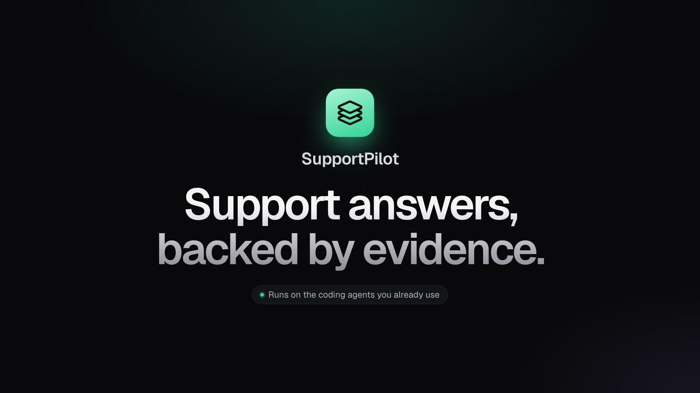
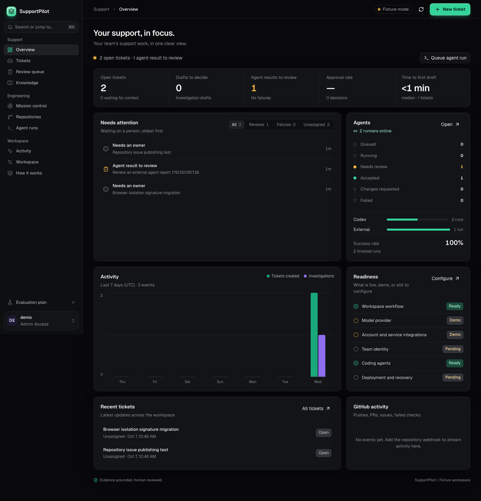
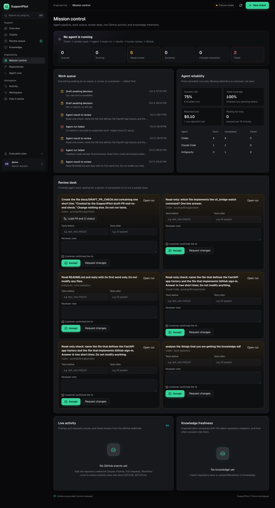
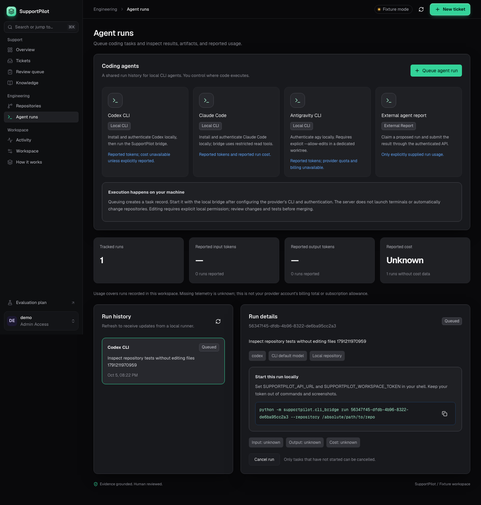
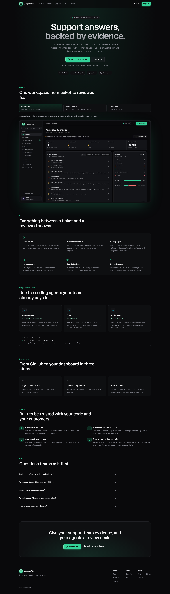
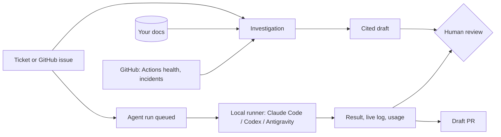

# SupportPilot

[](https://github.com/ayushap18/supportpilot/actions/workflows/ci.yml)

**Support answers, backed by evidence.** SupportPilot investigates support tickets against your docs and your GitHub repository, drafts an answer that cites its sources, hands code work to the coding agents you already use (Claude Code, Codex, or Antigravity), and keeps every decision with a person.

[](docs/media/launch.mp4)

▶ [Watch the 20-second launch video](docs/media/launch.mp4)

- **No API keys required.** Live investigations can run through your logged-in Claude Code, Codex, or Antigravity CLI. The Claude API and OpenAI work too, if you prefer keys.
- **Code stays on your machine.** The server never runs repository code. A runner you start locally does the agent work in your own checkout.
- **Every answer is checkable.** Drafts cite the exact documents and tool results they used, with a step-by-step trace.
- **A person always decides.** Drafts and agent results wait for review. Nothing is sent to customers or merged automatically.

## What it does

| Area | What you get |
| --- | --- |
| **Overview** | What needs you right now: open tickets, drafts to decide, agent results to review, failures, approval rate, time to first draft, activity, readiness. |
| **Tickets** | Triage with status, priority, owner, and internal notes. **Investigate** retrieves version-aware knowledge, checks live service health, and drafts a cited answer you approve or reject. |
| **Knowledge** | Upload Markdown or import a repository's README and `docs/`. Versioned, searchable, archivable. |
| **Repositories** | Sync commits, issues, contributors, docs, and files from repositories you choose; Actions status is read live for investigations and PRs. Issues labelled `support` become tickets; a signed webhook streams pushes, PRs, issues, and failed checks. |
| **Agent runs** | Queue a task for Claude Code, Codex, or Antigravity, with templates and a context pack of knowledge documents. A local runner picks it up, streams a live log, and reports results and token usage. Edit runs can push a branch and open a **draft** PR. |
| **Mission control** | The agent pipeline from queued to accepted, a work queue ordered by age, a review desk with test evidence and customer confirmation, PR review and CI status, agent reliability, and knowledge freshness. |
| **Team** | Sign up and sign in with GitHub. Workspaces are tied to a repository you can push to. Admins invite teammates by GitHub username. |



<details>
<summary>More screenshots</summary>






</details>

## How it works



1. **Sign up with GitHub** and choose a repository. SupportPilot creates a workspace connected to it and shows your workspace token once (it stores only a hash).
2. **Bring the context.** Import your docs and sync the repository. Tickets come from the app or from `support`-labelled issues.
3. **Investigate.** The model reads your knowledge and GitHub status, then drafts a cited answer. A person approves or rejects it.
4. **Hand off code work.** Queue an agent run; your local runner executes it and reports back. Review the result, then open a draft PR if it edited code.

## Quick start

Requirements: Python 3.12+, Node.js 22.12+, and Git.

```bash
python3 -m venv .venv
source .venv/bin/activate
python -m pip install -r requirements.lock
python -m pip install --no-deps --no-build-isolation -e .
python scripts/configure_local.py        # writes a private .env with a local workspace token
npm --prefix frontend ci
npm --prefix frontend run build
uvicorn supportpilot.app:create_app --factory --host 127.0.0.1 --port 8000
```

Open **http://127.0.0.1:8000**. To sign in without GitHub, choose **Sign in → Use a server-issued token** and paste the `token` value from `SUPPORTPILOT_API_TOKENS_JSON` in your `.env`. Reloading keeps you signed in for that tab; tick **Keep me signed in on this device** to stay signed in across tabs.

The default **fixture mode** is a deterministic demo with a fictional product (RelayDesk) and example tickets, so you can try everything without credentials. The local database lives in `.state/`; for PostgreSQL with pgvector, run `docker compose up --build`.

### Go live without API keys

Add this to `.env` and restart:

```dotenv
SUPPORTPILOT_MODE=live
SUPPORTPILOT_LLM_PROVIDER=cli          # use your logged-in CLI; or anthropic / openai with a key
SUPPORTPILOT_CLI_AGENT=claude_code     # claude_code | codex | antigravity
SUPPORTPILOT_INTEGRATIONS=github       # real service health and incidents from your repository
SUPPORTPILOT_TIMEOUT_SECONDS=180
```

The CLI runs each investigation step with tools disabled, in an empty temporary folder, and its output must match the investigation schema. Live mode never uses synthetic data. Import your own docs before investigating.

### Sign in with GitHub

Create a GitHub OAuth App with the callback `http://127.0.0.1:8000/api/auth/github/callback` (add `http://127.0.0.1:8000/api/github/callback` too for the in-app connect flow), then set `SUPPORTPILOT_GITHUB_CLIENT_ID`, `SUPPORTPILOT_GITHUB_CLIENT_SECRET`, and `SUPPORTPILOT_INTEGRATION_ENCRYPTION_KEY`. See [GitHub setup](docs/GITHUB_SETUP.md).

### Run coding agents

Install and log in to the agent CLIs you want (`claude`, `codex`, `agy`). Then link the `supportpilot` command onto your PATH once and start a runner inside a checkout:

```bash
ln -sf "$PWD/.venv/bin/supportpilot" ~/.local/bin/supportpilot   # once per machine

cd ~/code/your-repo
supportpilot login                 # once: saves this workspace's token (owner-only file)
supportpilot watch --allow-edits   # leave running; queued runs start automatically
```

Drop `--allow-edits` for read-only analysis. Add `--push` so edit runs push their branch and you can open a draft PR. Claude Code runs are analysis-only. Details: [Agent bridge](docs/AGENT_BRIDGE.md).

## Configuration

All settings are environment variables (or `.env`) prefixed with `SUPPORTPILOT_`. See [`.env.example`](.env.example).

| Setting | Default | Purpose |
| --- | --- | --- |
| `MODE` | `fixture` | `fixture` (deterministic demo) or `live` |
| `LLM_PROVIDER` | `openai` | Live model: `cli` (no key), `anthropic`, or `openai` |
| `CLI_AGENT` | `claude_code` | With `cli`: `claude_code`, `codex`, or `antigravity` |
| `ANTHROPIC_API_KEY`, `ANTHROPIC_MODEL`, `ANTHROPIC_EFFORT` | –, `claude-opus-5-5`, `medium` | Claude API provider |
| `OPENAI_API_KEY`, `MODEL`, `EMBEDDING_MODEL` | –, `gpt-4.1-mini`, `text-embedding-3-small` | OpenAI provider; a key also enables semantic embeddings |
| `INTEGRATIONS` | `synthetic` in fixture, `off` in live | `github` for real service health and incidents |
| `API_TOKENS_JSON` | `[]` | Server-issued workspace tokens with `admin` or `agent` roles |
| `GITHUB_CLIENT_ID`, `GITHUB_CLIENT_SECRET` | – | OAuth App for sign-in and repository connection |
| `INTEGRATION_ENCRYPTION_KEY` | – | Fernet key that encrypts stored GitHub tokens; keep it stable |
| `GITHUB_TOKEN` | – | Optional server-wide personal access token instead of OAuth |
| `GITHUB_SUPPORT_LABEL`, `GITHUB_WEBHOOK_SECRET` | `support`, – | Issue-to-ticket label; enables `POST /api/github/webhook` |
| `SLACK_WEBHOOK_URL` | – | Alerts for review-ready drafts and finished agent runs |
| `DATABASE_URL` | SQLite in `.state/` | PostgreSQL with pgvector for deployments |
| `TIMEOUT_SECONDS`, `MAX_INVESTIGATIONS_PER_HOUR`, `RETENTION_DAYS` | `45`, `30`, `30` | Budgets and retention |

## Security model

- **Tokens:** workspace tokens are random, shown once, and stored as SHA-256 hashes. Regenerating a lost token requires a fresh GitHub authorization and re-checks repository access. GitHub tokens are encrypted at rest.
- **Execution:** the server never runs repository code. Agent CLIs run only on a machine where you started a runner; edits happen in a separate git worktree and need `--allow-edits` on that machine. Nothing is merged automatically.
- **Live investigations:** the local CLI runs with tools disabled in an empty folder. Ticket text and tool data are treated as untrusted evidence, and secrets are redacted from drafts, logs, and agent results.
- **Webhooks:** requests must carry a valid HMAC signature. Browser sessions use `sessionStorage` (plus `localStorage` only if you choose to stay signed in) under a strict same-origin CSP.

## Build and test

```bash
ruff check . && ruff format --check .
pytest -q
python -m evals.run --minimum-outcome-accuracy .95
npm --prefix frontend run build
npm --prefix frontend exec playwright install chromium
npm --prefix frontend run test:browser
```

Stop local servers on port 8000 before browser tests; Playwright serves the built UI with production security headers and an isolated fixture database. CI runs backend tests on SQLite and PostgreSQL, the evaluation gate, the frontend build, Chromium workflow tests, and a Docker build.

## Evaluation

The versioned dataset has **30 development cases and 20 held-out cases** (fixture mode):

| Frozen fixture run | Retrieval-only baseline | Tool workflow |
| --- | --- | --- |
| Development outcomes | 22 / 30 | 30 / 30 |
| Held-out outcomes, three repetitions | 51 / 60 | 60 / 60 |

These are deterministic outcome checks, not a measure of live-model accuracy. See the [development report](docs/reports/development/REPORT.md), [held-out report](docs/reports/held-out/REPORT.md), [failure analysis](docs/reports/FAILURES.md), and [evaluation runner](evals/README.md).

## Deployment

The Docker image serves the UI and API; deployments use PostgreSQL with pgvector. [Deploy with a Render Blueprint](https://render.com/deploy?repo=https://github.com/ayushap18/supportpilot) and follow the [deployment guide](docs/DEPLOYMENT.md). Main-branch CI can trigger a deploy of the tested commit through the `RENDER_DEPLOY_HOOK_URL` repository secret.

## Status and limits

- Live mode has been verified end to end with the local Claude Code and Codex CLIs and real GitHub data. No public deployment is provisioned yet.
- Account lookups are not connected to a real system; investigations hand account-specific checks to a person.
- Customer replies are not sent from the app, and external help-desk intake is not connected.
- Repository access uses an OAuth App; a GitHub App with per-repository permissions is the planned upgrade for organizations.

## Documentation

- [User guide](docs/USER_GUIDE.md): day-to-day workflow
- [GitHub setup](docs/GITHUB_SETUP.md): sign-in, repositories, webhooks, invitations
- [Agent bridge](docs/AGENT_BRIDGE.md): runners, provider boundaries, draft PRs
- [Design system](docs/DESIGN.md): tokens, layout, components, accessibility
- [Architecture](docs/ARCHITECTURE.md) and [runtime decision record](docs/decisions/0001-mvp-runtime.md)
- [Deployment](docs/DEPLOYMENT.md) and [release checklist](docs/RELEASE_CHECKLIST.md)
- [Evaluation plan](docs/EVALUATION.md)
- API contracts: `/openapi.json` on a running server

Use synthetic inputs while evaluating, and keep credentials out of version control.
