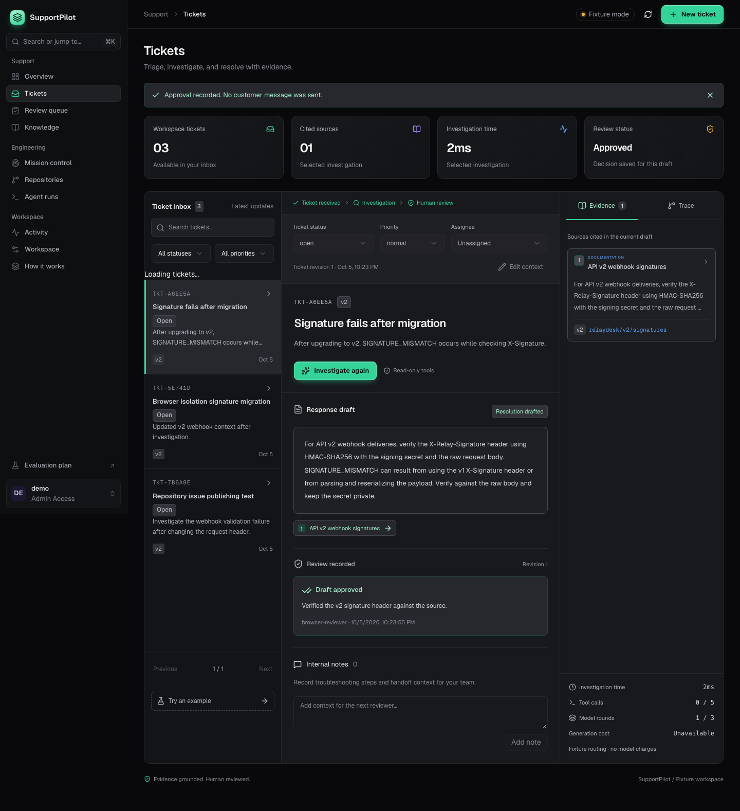

# SupportPilot

[](https://github.com/ayushap18/supportpilot/actions/workflows/ci.yml)

**Investigate technical support tickets, inspect the evidence, and review a response draft.**

SupportPilot is a standalone operational pilot for a small support team: manage tickets, maintain a knowledge library, investigate issues, and review evidence-backed response drafts. Its default **RelayDesk** demo uses a fictional webhook SaaS and synthetic records.

> **Current status:** the application works in fixture mode. The live OpenAI adapter and Render deployment workflow are implemented, but real provider validation, public hosting, and human-reviewed AI quality gates remain pending credentials and release work.



## What works

- Overview with real ticket counts, current review backlog, seven-day UTC trends, and readiness items.
- Searchable, paginated tickets with status, priority, assignment, editable context, and internal notes.
- Workspace knowledge with versioned sources, indexed search, archive/restore, and admin-only mutations.
- Version-aware, workspace-scoped retrieval and bounded investigations with inspectable evidence and trace.
- Current draft review queue, approve/reject decisions, and guards against stale ticket edits or draft approvals.
- Activity history, configured team roles, execution budgets, hourly limits, and restart recovery.
- Responsive dark Overview, Tickets, Review queue, Knowledge, Activity, and Workspace views.
- Reproducible fixture evaluations and prepared CI/deployment workflows.

Approval records a decision inside SupportPilot. Ticket resolution is a separate operator action. Customer delivery and external help-desk intake are not connected. Follow the [user guide](docs/USER_GUIDE.md) or inspect the [real-use implementation plan](docs/REAL_USE_PLAN.md).

## GitHub and coding-agent workspace

The engineering workspace extends support tickets into repository work:

- **Repositories:** authorize GitHub, browse accessible repositories, select up to 25, and synchronize bounded snapshots of commits, issues, contributors, activity, files, and documentation. Inspect commit patches and scan limits.
- **Knowledge:** import README/`docs/` sources or preview and save uploaded UTF-8 Markdown/text files. Imports retain document revisions and search indexing; archive obsolete sources explicitly.
- **Linked issues:** review a ticket and explicitly publish its subject/description to GitHub. Saved links and uncertain-write reconciliation prevent blind duplicate creation.
- **Mission control:** one view of the agent pipeline (queued → running → needs review → accepted / changes requested / failed), a work queue of everything waiting on a person, a review desk with fix verification (tests before/after, reviewer note, customer confirmation), live PR review and CI/deployment status, agent reliability by provider, a live GitHub activity inbox, and knowledge freshness (docs changed or removed upstream, last indexed, citations). Runs support search and filters, a timeline, task templates, and context packs of knowledge documents. [Screenshot](docs/screenshots/mission-control.png).
- **Sign up / sign in with GitHub:** choose a repository you can push to and receive a workspace token (shown once, stored hashed). Sign-in checks that the token belongs to your GitHub account; lost tokens are regenerated only after a fresh GitHub authorization. Admins invite teammates by GitHub username.
- **Issues to tickets:** open issues labelled `support` become linked tickets on sync or via a signed webhook; pushes flag stale snapshots.
- **Live runner and draft PRs:** `cli_bridge watch` executes queued runs automatically with live progress logs; edit runs can push their branch, and **Open draft PR** creates a draft pull request for review.
- **Claude or OpenAI:** live investigations can use Claude (`SUPPORTPILOT_LLM_PROVIDER=anthropic`, default model `claude-opus-5-5`) or OpenAI.
- **Metrics and alerts:** approval rate and median time to first draft / resolution on the Overview; optional Slack alerts for review-ready drafts and finished agent runs.
- **Agent runs:** queue a ticket-linked task for Codex, Claude Code, Antigravity, or an external-report adapter. Execute named CLIs through the local bridge and inspect results, reported tokens/cost, and branch/patch artifacts.

The server does not execute repository code. The bridge defaults to Codex read-only analysis; Codex edits and Antigravity require explicit `--allow-edits` and a dedicated worktree. Claude Code currently supports analysis only. A finished run does not automatically resolve a ticket or merge code. Provider account quotas and subscription billing are not available through run telemetry.

[Repository dashboard preview](docs/screenshots/repositories.png) (mock GitHub fixture) · [Agent runs preview](docs/screenshots/agent-runs.png).

GitHub OAuth is a repository connection for an existing workspace, not a replacement for workspace-token sign-in. Real GitHub authorization and CLI execution require your own credentials; tests use provider/API doubles and do not establish a live integration. Start with [GitHub setup](docs/GITHUB_SETUP.md), [the CLI bridge](docs/AGENT_BRIDGE.md), and [the engineering plan](docs/ENGINEERING_WORKSPACE_PLAN.md).

## Interface

The frontend uses React, TypeScript, Tailwind CSS v4, and shadcn/ui (Radix) primitives, including a ⌘K command palette and account menu. A token-based dark design system (Geist type, one emerald accent, semantic status colors) is specified in [docs/DESIGN.md](docs/DESIGN.md). Every stylesheet color resolves to a design token.

21st.dev catalog components require an `API_KEY_21ST`; none were installed without one. See the design doc for how to add them.

## Example

A ticket says: “After upgrading to API v2, our webhook receiver reports SIGNATURE_MISMATCH.”

SupportPilot retrieves the v2 signature documentation and drafts guidance about `X-Relay-Signature` and raw-body verification. The reviewer can inspect the cited excerpt and approve or reject the draft. Other examples exercise account checks, missing context, outages, and unsupported requests.

## Fixture mode and live mode

| Mode | Retrieval | Draft generation | Provider credentials |
| --- | --- | --- | --- |
| Fixture, default | Lexical feature hashing and text ranking | Deterministic demonstration routing | None |
| Live | OpenAI embeddings over workspace documents | Schema-validated OpenAI Responses drafts; external tools disabled | Required |

Fixture mode includes synthetic tools and example documents. Live mode excludes synthetic seed documents and disables account/service/incident tools until real adapters exist; add your own knowledge first.

Fixture results demonstrate application behavior. They do **not** establish live-model accuracy. The UI labels the active mode. Real provider requests have not yet been verified; the live adapter is covered by mocked contract tests.

## Run locally

Requirements: Python 3.12+ and Node.js 22.12+.

From the repository root:

```bash
python3 -m venv .venv
source .venv/bin/activate
python -m pip install -r requirements.lock
python -m pip install --no-deps --no-build-isolation -e .
python scripts/configure_local.py
npm --prefix frontend ci
npm --prefix frontend run build
uvicorn supportpilot.app:create_app --factory --host 127.0.0.1 --port 8000
```

Open **http://127.0.0.1:8000**. Open your private `.env` locally and copy the `token` value inside `SUPPORTPILOT_API_TOKENS_JSON` into the workspace connection form. The token stays in browser memory and clears on reload. The configuration script refuses to overwrite an existing `.env`.

Token entries accept an optional `role`: `admin` can manage knowledge, while `agent` can work tickets and review drafts. Legacy entries default to admin. Configure identities on the server; see [team configuration](docs/DEPLOYMENT.md#workspace-identities).

This setup uses a persistent SQLite database in `.state/`. For PostgreSQL/pgvector, use `docker compose up --build` after creating `.env`. PostgreSQL integrations run in GitHub CI.

For frontend development, run the API on port 8000 and `npm --prefix frontend run dev` in another terminal. Vite proxies API requests.

## Build and test

```bash
ruff check .
ruff format --check .
pytest -q
python -m evals.run --minimum-outcome-accuracy .95
npm --prefix frontend run build
npm --prefix frontend exec playwright install chromium
npm --prefix frontend run test:browser
```

Build the frontend and stop local API servers before browser tests: Playwright serves the compiled UI on port 8000 with production security headers and an isolated fixture database. Browser coverage exercises investigation/review, ticket operations, knowledge management, keyboard interaction, and responsive navigation.

CI runs backend tests against SQLite and PostgreSQL, a fixture evaluation regression gate, frontend compilation, Chromium workflow tests, and a Docker build/smoke test. The local PostgreSQL integration test is skipped unless `SUPPORTPILOT_TEST_POSTGRES_URL` points to a dedicated test database.

## Evaluation evidence

The versioned dataset contains **30 development cases and 20 held-out cases**. Published fixture measurements compare the same corpus and inputs:

| Frozen fixture run | Retrieval-only baseline | Tool workflow |
| --- | --- | --- |
| Development outcomes | 22 / 30 | 30 / 30 |
| Held-out outcomes, three repetitions | 51 / 60 | 60 / 60 |

These are deterministic outcome checks. Semantic citation accuracy and real resolution correctness still require live-model runs and human review. Some required references are missed by retrieval; successful routing does not erase that limitation.

See the [development report](docs/reports/development/REPORT.md), [held-out report](docs/reports/held-out/REPORT.md), and [failure analysis](docs/reports/FAILURES.md). The [evaluation runner](evals/README.md) explains metrics, provenance, and spend limits. A separately triggered GitHub workflow runs budgeted live evaluations after configuration.

## Deployment

[Deploy with a Render Blueprint](https://render.com/deploy?repo=https://github.com/ayushap18/supportpilot), then follow [the deployment guide](docs/DEPLOYMENT.md).

The Docker service serves both the UI and API. A private PostgreSQL database stores tickets, notes, activity, knowledge sources/vectors, investigations, and reviews. Successful main-branch CI can request a deployment of the tested commit using the private `RENDER_DEPLOY_HOOK_URL` repository secret. No public service has been provisioned yet.

## Milestones

| Milestone | Status | Tracking |
| --- | --- | --- |
| 1. Fixtures and contracts | Implemented and tested | [#1](https://github.com/ayushap18/supportpilot/issues/1) |
| 2. Retrieval baseline | Implemented; PostgreSQL CI verified | [#2](https://github.com/ayushap18/supportpilot/issues/2) |
| 3. Investigation workflow | Implemented and tested | [#3](https://github.com/ayushap18/supportpilot/issues/3) |
| 4. Review interface | Implemented; browser tests verified | [#4](https://github.com/ayushap18/supportpilot/issues/4) |
| 5. Evaluation | Runner and fixture reports complete; live and human review pending | [#5](https://github.com/ayushap18/supportpilot/issues/5) |
| 6. Deployment and portfolio | Packaging/workflows prepared; public demo and walkthrough pending | [#6](https://github.com/ayushap18/supportpilot/issues/6) |

## Project documents

- [User guide](docs/USER_GUIDE.md), [real-use plan](docs/REAL_USE_PLAN.md), and [release checklist](docs/RELEASE_CHECKLIST.md).
- [Original implementation plan](docs/PLAN.md) and acceptance checklists.
- [Architecture](docs/ARCHITECTURE.md) and [runtime decision record](docs/decisions/0001-mvp-runtime.md).
- [Evaluation plan](docs/EVALUATION.md) and [evaluation runner](evals/README.md).
- [Deployment and operations](docs/DEPLOYMENT.md).
- API contracts are available at `/openapi.json`.

Use synthetic inputs and keep credentials outside version control. See the deployment guide for retention, request limits, and the pilot's operational boundaries.
