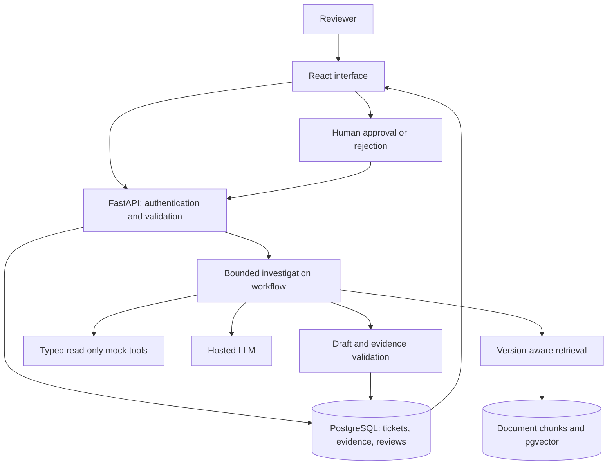

# Architecture

This document describes the planned MVP. No services are implemented yet.

## System flow



The API executes the first vertical slice directly with strict timeouts. Introduce a persistent background worker if measured request duration or restart recovery requires it; record that decision before adding another service. Durable investigation state lives in PostgreSQL either way.

## Planned repository layout

```text
backend/              FastAPI app, workflow, retrieval, tool adapters
frontend/             React ticket and review interface
data/relaydesk/        Synthetic product documentation and mock records
evals/                Labeled cases, runner, and report generation
tests/                Contract, workflow, and access-control tests
docs/                 Design, setup, and architecture decisions
.github/workflows/    CI and explicitly triggered live evaluations
```

Only `docs/` and the root planning files currently exist. Create application directories when implementing their first working functionality.

## Main entities

| Entity | Required information |
| --- | --- |
| Ticket | ID, workspace, subject, description, product version, bounded log |
| Document | ID, workspace, version, revision, title, source path |
| Evidence | Document/chunk ID or tool result ID, exact excerpt, provenance |
| Investigation | Ticket ID, state, timestamps, budgets, usage, failure details |
| Draft | Revision, outcome, response, missing information, evidence references |
| Review | Draft revision, reviewer identity, decision, note, timestamp |

Use schema-validated model output. Return user-visible rationale and evidence summaries; do not request, persist, or display private chain-of-thought.

## Proposed API

| Endpoint | Purpose |
| --- | --- |
| `POST /tickets` | Validate and persist a ticket |
| `POST /tickets/{id}/investigations` | Start an investigation, accepting an idempotency key |
| `GET /investigations/{id}` | Read progress, draft, evidence, and usage |
| `POST /investigations/{id}/reviews` | Approve or reject an exact draft revision |
| `GET /health/live` | Process liveness |
| `GET /health/ready` | Database and service readiness |

All ticket, investigation, and review endpoints require workspace authorization. The demo may provide a seeded read-only view, but unauthenticated visitors cannot invoke costly investigations or write reviews.

## Read-only tools

- `get_account_status(account_id)`: returns account state and relevant plan limits.
- `get_service_health(service_name)`: returns current synthetic service status.
- `search_known_incidents(query, product_version)`: returns matching incident records.

Resolve the caller's workspace on the server. Tools operate only on allowlisted mock records. No tool accepts a shell command, arbitrary URL, SQL query, or model-supplied authorization identity.

## Reliability and boundaries

- Three model rounds, five tool calls, and configurable wall-clock/token budgets per investigation.
- Typed tool arguments, capped output size, explicit errors, and bounded transient retries.
- Idempotent investigation requests and immutable draft revisions.
- Logs and documents remain untrusted evidence, including instructions embedded inside them.
- Source version and workspace restrictions apply before ranking, not only after generation.
- Validate citation IDs against available evidence; claim support is additionally checked through evaluation and human review.
- Keep API keys on the server; exclude secrets and raw sensitive payloads from logs.
- Document retention and deletion behavior before making the demo available.

## Observability

Assign a trace ID to each investigation. Record workflow stage durations, retrieved source IDs, validated tool calls/results, model identifiers, prompt version, input/output token counts, outcome, and errors.

Estimate model cost using dated provider pricing captured in evaluation configuration. Label missing usage or incomplete pricing as unavailable rather than reporting a misleading zero. Display latency and cost alongside quality metrics.
