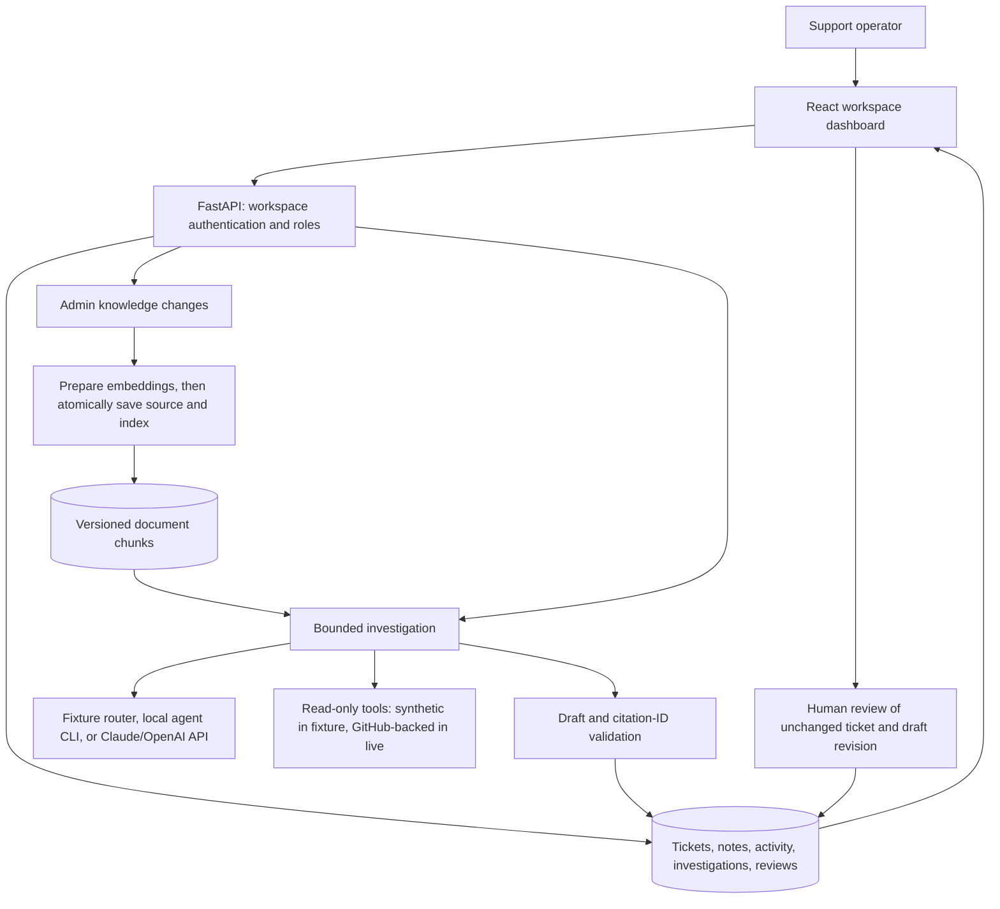

# Architecture

SupportPilot is a support and engineering workspace for a small team. The [real-use plan](REAL_USE_PLAN.md) defines its original contracts; the [user guide](USER_GUIDE.md) explains the operator workflow. Live mode has been verified with local agent CLIs and real GitHub data; public hosting is not yet provisioned.

## System flow

The API serves the compiled frontend and executes investigations directly with bounded timeouts. PostgreSQL/pgvector is the deployment database; SQLite is the local fallback. Run one API worker. Startup marks interrupted queued/running investigations failed, and a new idempotency key is needed to retry them. There is no persistent job queue or external help-desk connector.

## State and authorization

| Entity | Stored information |
| --- | --- |
| Ticket | Workspace, subject/context, version/account, status, priority, assignee, revision, timestamps |
| Internal note | Ticket/workspace, body, author, timestamp |
| Activity | Ticket edits and notes; creation, investigation, and review events also derive from persisted records |
| Knowledge document | Workspace, title/body, version, source path, revision, archive state, update time |
| Chunk | Source ID/revision, workspace/version, excerpt, embedding, index signature |
| Investigation | Captured ticket revision, state, draft, evidence snapshot, trace, usage, failure details |
| Review | Investigation/draft revision, reviewer, decision, note, timestamp |

Bearer tokens identify a workspace, reviewer, and `admin` or `agent` role. They come from server configuration or from GitHub sign-up and invitations (stored as SHA-256 hashes; repository admins and maintainers become admins). Both roles can operate tickets and review drafts; only admins can mutate knowledge, manage GitHub, queue agent runs, and invite teammates. Workspace scope applies before access and retrieval. Local agent CLIs run only on machines where someone started a runner; the server never executes repository code.

Ticket updates require `expected_revision` and perform an atomic revision comparison. A stale edit returns 409. Reviews reject a draft if the ticket revision changed after investigation began. PostgreSQL locks the ticket during review; SQLite serializes the short review transaction. A uniqueness constraint prevents duplicate review decisions for the same draft. Approval and ticket resolution are separate actions.

## API groups

All `/api` routes below require workspace authentication, except `/api/config`. Full schemas are available at `/openapi.json`.

| Route | Purpose |
| --- | --- |
| `/api/session`, `/api/operations` | Identity, configuration, real counts, seven-day UTC trends, recent activity |
| `/api/tickets`, `/api/tickets/{id}` | Create/list/read tickets and revision-guarded edits |
| `/api/queue` | Paginated search with status, priority, and pending-review filters |
| `/api/tickets/{id}/notes` | Read/add internal notes |
| `/api/tickets/{id}/investigations` | Read/start investigations with an idempotency key |
| `/api/investigations/{id}/reviews` | Read/record exact draft decisions |
| `/api/knowledge/documents` | Read/create sources; per-document edit/archive/restore routes |
| `/api/knowledge/search` | Search indexed knowledge with workspace/version filtering |
| `/health/live`, `/health/ready` | Process and database checks |

Queue review state uses the latest investigation per ticket. Dashboard counts include all workspace tickets rather than the legacy list endpoint's 100-item cap. Reporting currently aggregates workspace records in memory; larger deployments need measured query/index improvements. Activity is capped to the latest 50 events. No SLA, satisfaction, uptime, or live accuracy values are invented.

## Retrieval and modes

Knowledge mutations prepare embeddings before opening the write transaction. The source update and chunk replacement then commit together, using revision guards. Failed preparation saves neither change. Archive deletes searchable chunks but retains the document; restore prepares and writes its index again. Startup retains active workspace documents and refreshes changed source/embedding signatures.

Fixture mode loads the synthetic RelayDesk corpus, hashes lexical features, and uses deterministic answer routing. Live mode excludes synthetic seed documents and uses hosted embeddings with structured model output. PostgreSQL combines vector and lexical rankings; SQLite supports the local fallback. Workspace and version restrictions apply before ranking.

Three typed tools (`get_account_status`, `get_service_health`, `search_known_incidents`) read allowlisted synthetic records in fixture mode only. Live application investigations pass `allow_tools=False`; real adapters must be implemented before current account or service state can be verified.

## Reliability and release boundaries

- Up to three model rounds, five tool calls, and a 45-second overall investigation deadline; bounded input/output and hourly workspace limits.
- Idempotent investigation creation, persisted results, and explicit restart failures.
- Ticket text, documents, and tool results remain untrusted evidence. Structured output and citation-ID validation do not prove semantic claim correctness; live evaluations and human review are required.
- Trace records show executed stages, tool arguments/results, durations, and reported usage. Private model reasoning is neither requested nor exposed.
- Missing prices display unavailable cost. Generation estimates exclude embedding costs and unreported failed-call usage.
- Startup retention purges expired tickets and their notes, activity, investigations, and reviews; knowledge sources are retained.
- SQLAlchemy creates new tables at startup. Explicit migrations, backup/restore verification, identity onboarding, and data-handling policy are required before customer rollout.
